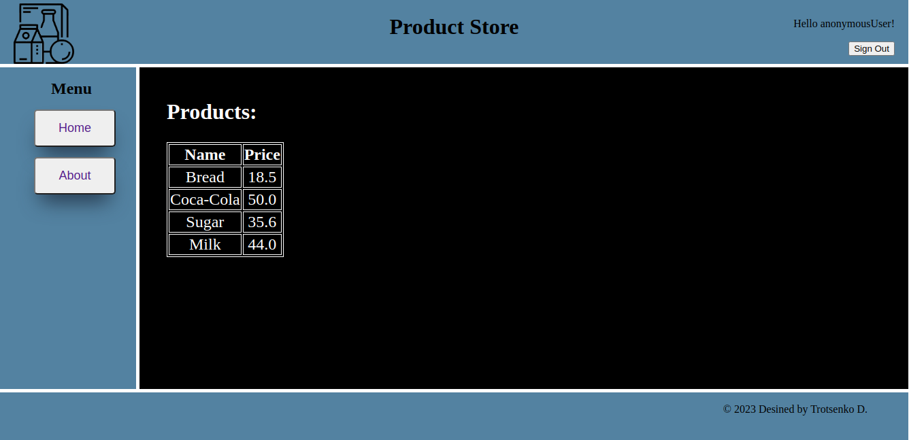

# Product Shop App with PostgreSQL, Spring Web and Spring Security

This project is a simple product shop application with:  **Spring Boot**, **Spring Web**, **Spring Security**,
**PostgreSQL**, **JPA (Hibernate)**, **Flyway**, and **Thymleaf**.
### Project structure

| Folder                        | Description                                                   |
|-------------------------------|---------------------------------------------------------------|
| deploy                        | Contains the docker-compose.yml used to setup the application |
| src/main/java/com/productShop | Spring boot application ProductShopApp.java                   |

### How to build and run

In order to build the application you need to have the following software products installed:
- JDK >= 17
- docker & docker compose

### Exploring the Product Shop App

The server will start at <http://localhost:8080>.

Home page : <http://localhost:8080/home>  

Login page : <http://localhost:8080/login?logout>

Role Admin:  
User Name: admin  
Password: admin

Role User:  
User Name: user  
Password: user

Product service page : <http://localhost:8080/products>  

If you click on the link <http://localhost:8080/products> without being authorized as an admin :  

Add product page : <http://localhost:8080/products/add>  

Find product by id :  
